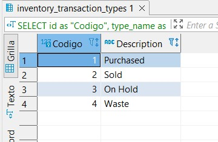
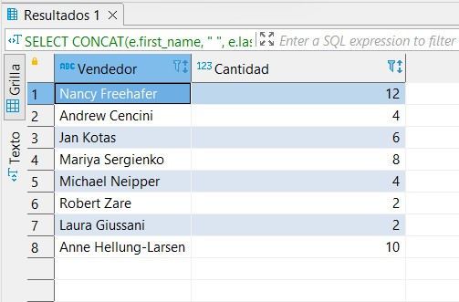
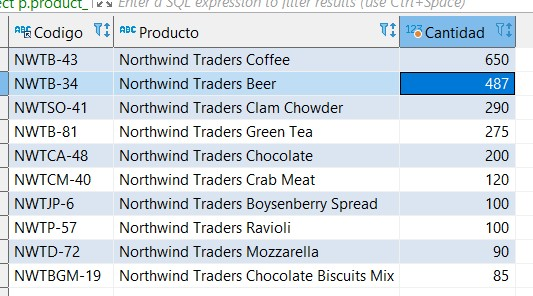
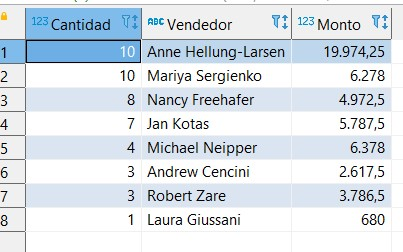
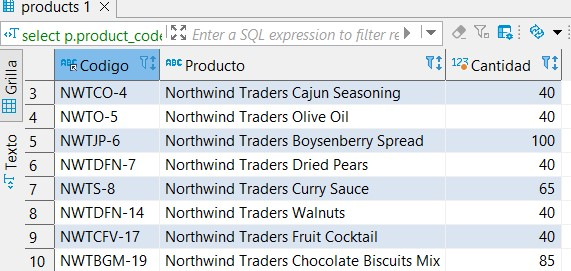
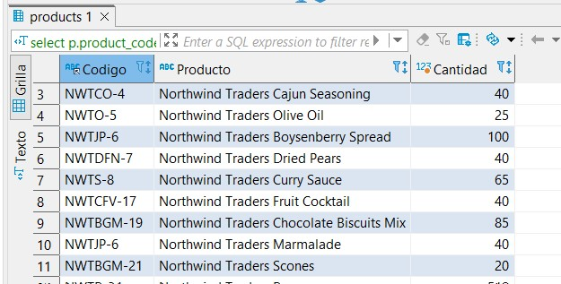
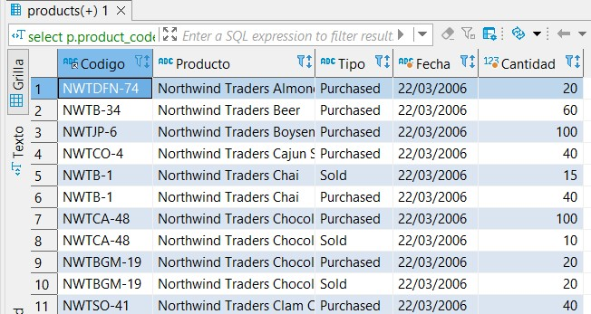
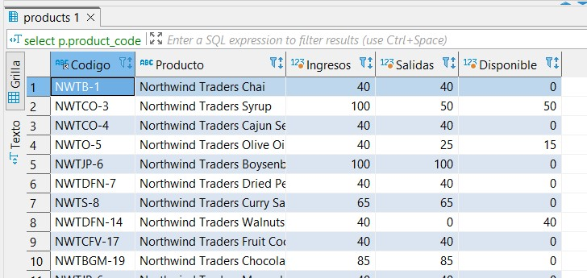

# WorkShop 3

## Preparando el ambiente

Entramos a Mysql
`sudo mysql`

Creamos la DB
`create database northwind`

Creamos un usuario
`create user user_laravel identified by "12345"`

Le damos permisos
` grant all privileges on northwind.\* to user_laravel`

Habilitamos las conexiones remotas de mysql
`nano /etc/mysql/mariadb.conf.d/50-server.cnf`

Y comentamos la linea

```
# bind-address = 127.0.0.1
```

Reiniciamos mariadb
`sudo systemctl restart mysql`

Cargamos nuestro backup
`mysql northwind > northwind.sql`
`mysql northwind > northwind-data.sql`

Nos conectamos desde la maquina local con un gestor como DBEAVER o TABLEPLUS

# Challenges

## Challenge 1

Recupere el código (id) y la descripción (type_name) de los tipos de movimiento de inventario (inventory_transaction_types).

```sql
SELECT id as "Codigo", type_name as "Description" FROM inventory_transaction_types
```



## Challenge 2

Recupere la cantidad de ordenes (orders)
registradas por cada vendedor (employees).

```sql
SELECT
CONCAT(e.first_name, " ", e.last_name) as `Vendedor`,
COUNT(1) as `Cantidad`
from orders o
join employees e
on e.id = o.employee_id
GROUP BY `Vendedor`
ORDER BY e.id
```



## Challenge 3

Recupere la lista de los 10 productos más ordenados (order_details),
y la cantidad total de unidades ordenadas para cada uno de los
productos.
Deberá incluir como mínimo los campos de código (product_code),
nombre del producto (product_name) y la cantidad de unidades.

```sql
select p.product_code as `Codigo`,
        p.product_name as `Producto`,
        round(sum(od.quantity),2) as `Cantidad`
        from products p
        join order_details od
            on od.product_id = p.id
        group by p.id
        order by `Cantidad` DESC
        limit 10;
```



## Challenge 4

Recupere el monto total (invoices, orders, order_details, products) y la
cantidad de facturas (invoices) por vendedor (employee). Debe
considerar solamente las ordenes con estado diferente de 0 y
solamente los detalles en estado 2 y 3, debe utilizar el precio
unitario de las lineas de detalle de orden, no considere el descuento,
no considere los impuestos, porque la comisión a los vendedores se
paga sobre el precio base.

```sql
select count(1) as `Cantidad`,
		concat(e.first_name, ' ', e.last_name) as `Vendedor`,
        round(sum(od.unit_price * od.quantity),2) as `Monto`
        from employees e
        join orders o
        	on o.employee_id = e.id
        join order_details od
        	on od.order_id = o.id
        where o.status_id <> 0
        	and od.status_id in (2,3)
        group by e.id
        order by `Cantidad` DESC, e.first_name ASC;
```



## Challenge 5

Recupere el monto total (invoices, orders, order_details, products) y la
cantidad de facturas (invoices) por vendedor (employee). Debe
considerar solamente las ordenes con estado diferente de 0 y
solamente los detalles en estado 2 y 3, debe utilizar el precio
unitario de las lineas de detalle de orden, no considere el descuento,
no considere los impuestos, porque la comisión a los vendedores se
paga sobre el precio base.

```sql
select p.product_code as `Codigo`,
    p.product_name as `Producto`,
    sum(it.quantity) as `Cantidad`
    from products p
    join inventory_transactions it
        on it.product_id = p.id
    where it.transaction_type in (1)
    group by p.id;
```



## Challenge 6

Recupere los movimientos de inventario del tipo salida. Tomando como base todos los movimientos de inventario (inventory_transactions), considere unicamente los tipos de movimiento (transaction_type) 2, 3 y 4 como salidas. Debe agrupar por producto (products) y deberá incluir como mínimo los campos de código (product_code), nombre del producto (product_name) y la cantidad de unidades que salieron.

```sql
select p.product_code as `Codigo`,
    p.product_name as `Producto`,
    sum(it.quantity) as `Cantidad`
    from products p
    join inventory_transactions it
        on it.product_id = p.id
    where it.transaction_type in (2,3,4)
    group by p.id;
```



## Challenge 7

Genere un reporte de movimientos de inventario (inventory_transactions) por producto (products), tipo de transacción y fecha, entre las fechas 22/03/2006 y 24/03/2006 (incluyendo ambas fechas). Debe incluir como mínimo el código (product_code), el nombre del producto (product_name), la fecha truncada (transaction_created_date), la descripción del tipo de movimiento (type name) y la suma de cantidad (quantity) .

```sql
select p.product_code as `Codigo`,
    p.product_name as `Producto`,
    itt.type_name as `Tipo`,
    date_format(it.transaction_created_date, "%d/%m/%Y") as `Fecha`,
    sum(it.quantity) as `Cantidad`
    from inventory_transactions it
    join products p
        on it.product_id = p.id
    join inventory_transaction_types itt
        on it.transaction_type = itt.id
    where it.transaction_created_date between '2006-03-22' and '2006-03-24'
    group by it.id
	order by p.product_name asc;
```



## Challenge 8

Genere la consulta SQL para un reporte de inventario, tomando como base todos los movimientos de inventario (inventory_transactions), considere los tipos de movimiento (transaction_type) 2, 3 y 4 como salidas y el tipo 1 como ingreso. Este reporte debe estar agrupado por producto (products) y deberá incluir como mínimo los campos de código (product_code), nombre del producto (product_name) y la sumarización de ingresos, salidas y la cantidad disponible en inventario (diferencia de ingresos - salidas).

```sql
select p.product_code as `Codigo`,
    p.product_name as `Producto`,
    sum(if(it.transaction_type = 1, it.quantity, 0)) as `Ingresos`,
    sum(if(it.transaction_type > 1, it.quantity, 0)) as `Salidas`,
    sum(if(it.transaction_type = 1, it.quantity, 0)) - sum(if(it.transaction_type > 1, it.quantity, 0)) as `Disponible`
    from products p
    join inventory_transactions it
        on it.product_id = p.id
    group by p.id;
```


